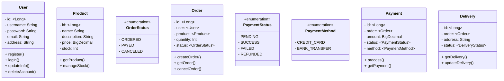

# Commerce System Backend(be)

## 개발 환경

- Java: Amazon JDK(Corretto) 11
- Build Tool: Gradle
- Framework: Spring Boot 2.7.18
- Database: H2(test), Postgres(except test)
- Persistence: Spring Data JPA, Querydsl + MyBatis(SQL Mapper)
- Test: JUnit5, Mockito
- IDE: IntelliJ IDEA

## 서비스 요구 사항

- [ ] 회원 기능
    - [x] 가입
    - [x] 로그인
    - [ ] 정보 수정
    - [ ] 탈퇴
- [ ] 상품 기능
    - [ ] 조회
    - [ ] 재고 관리
- [ ] 주문 기능
    - [ ] 생성
    - [ ] 조회
    - [ ] 취소
- [ ] 결제 기능
    - [ ] 처리
    - [ ] 내역 조회

## Class Diagram

