# Commerce System Backend(be)

## 개발 환경

- Java: Amazon JDK(Corretto) 11
- Build Tool: Gradle
- Framework: Spring Boot 2.7.18
- Database: H2(test), Postgres(except test)
- Persistence: Spring Data JPA, Querydsl + MyBatis(SQL Mapper)
- Test: JUnit5, Mockito
- IDE: IntelliJ IDEA

## 서비스 요구 사항

- [ ] 회원 기능
    - [x] 가입
    - [x] 로그인
    - [x] 정보 수정
    - [ ] 탈퇴
- [ ] 상품 기능
    - [x] 조회
    - [ ] 재고 관리
- [ ] 주문 기능
    - [x] 생성
    - [x] 조회
    - [ ] 취소
- [ ] 결제 기능
    - [ ] 처리
    - [ ] 내역 조회

## Class Diagram

```mermaid
classDiagram
    class User {
        - id: ~Long~
        - username: String
        - password: String
        - email: String
        - address: String
    }

    class Product {
        - id: ~Long~
        - name: String
        - description: String
        - price: BigDecimal
        - stock: Int
        - category: ~Category~
    }

    class Category {
        - id: ~Long~
        - name: String
        - parent: ~Category~
        - children: List<~Category~>
    }

    class OrderStatus {
        <<enumeration>>
        - ORDERED
        - PAID
        - CANCELED
    }

    class Order {
        - id: ~Long~
        - user: ~User~
        - product: ~Product~
        - quantity: Int
        - status: ~OrderStatus~
    }

    class PaymentStatus {
        <<enumeration>>
        - PENDING
        - SUCCESS
        - FAILED
        - REFUNDED
    }

    class PaymentMethod {
        <<enumeration>>
        - CREDIT_CARD
        - BANK_TRANSFER
    }

    class Payment {
        - id: ~Long~
        - order: ~Order~
        - amount: BigDecimal
        - status: ~PaymentStatus~
        - method: ~PaymentMethod~
    }

    class Delivery {
        - id: ~Long~
        - order: ~Order~
        - address: String
        - status: ~DeliveryStatus~
    }
```



## CLI

```shell
# 8080 포트 사용중인 프로세스 ID 확인
$ lsof -i :8080 # Mac or Linux
$ netstat -ano | findstr :8080 # Windows
```
